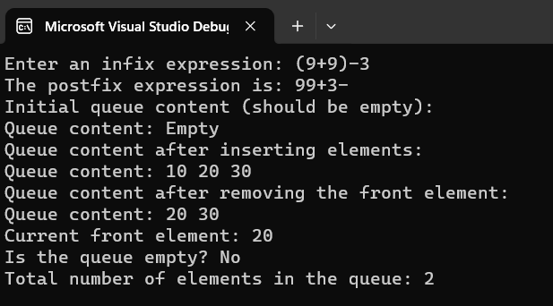
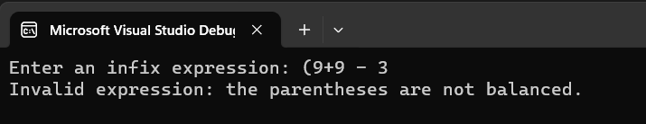

# Assignment 3

Upon running the code, you will be asked to input an infix expression, which will be checked to see if it is balanced. If it is, it will convert the infix notation to postfix notation. After doing this, the output will show the Queue data structure's operations - like inserting to the queue, removing an element, displaying the first element in the front of the queue, and displaying the number of elements in the queue. These elements can be changed within the cpp file.

## How to Run the Code

1. Download the `Assignment3.cpp` and `Assignment3.h` files from this repository.
2. Place `Assignment3.cpp` and `Assignment3.h` in the same directory.
3. Open a terminal or command prompt in that directory.
4. Compile and execute the program.

## Screenshots

